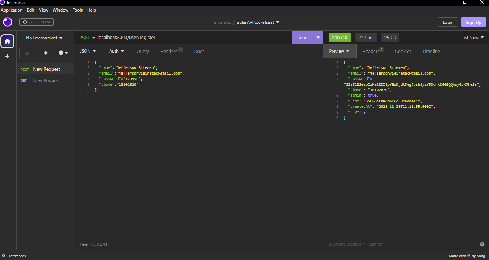
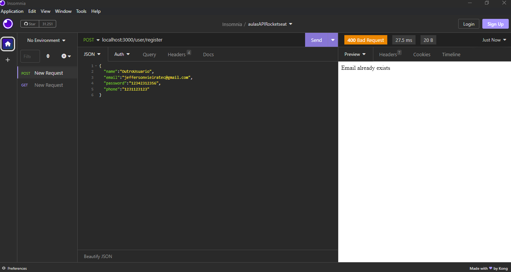
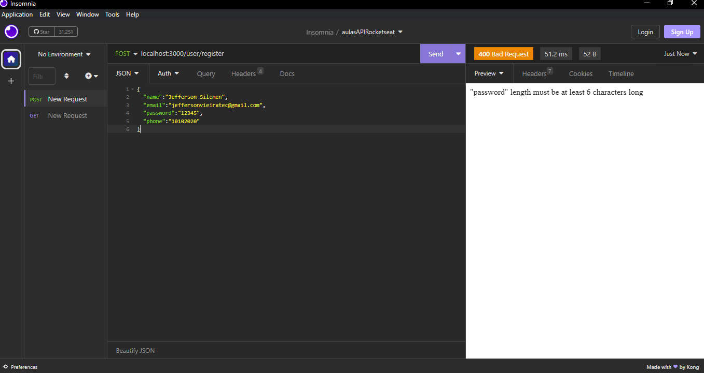
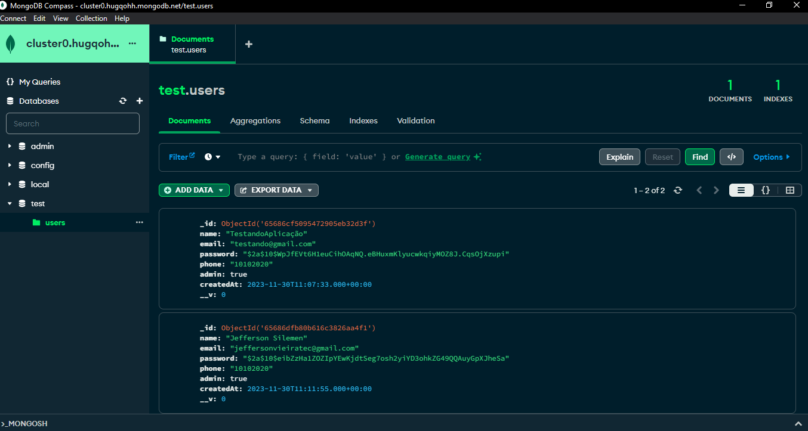
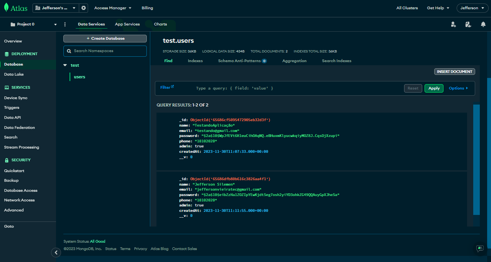
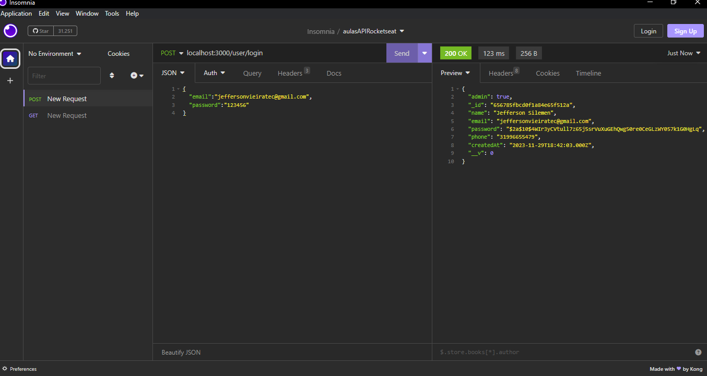
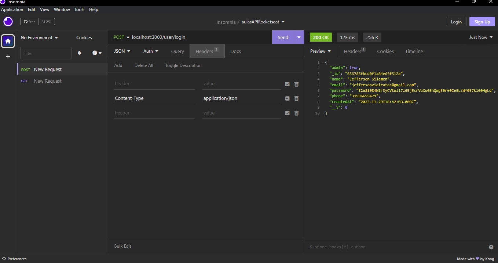
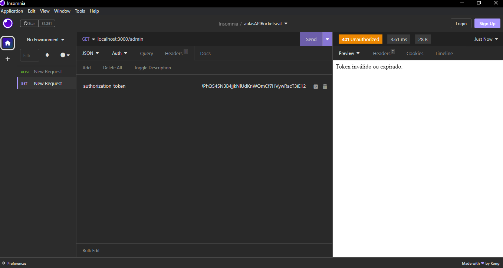
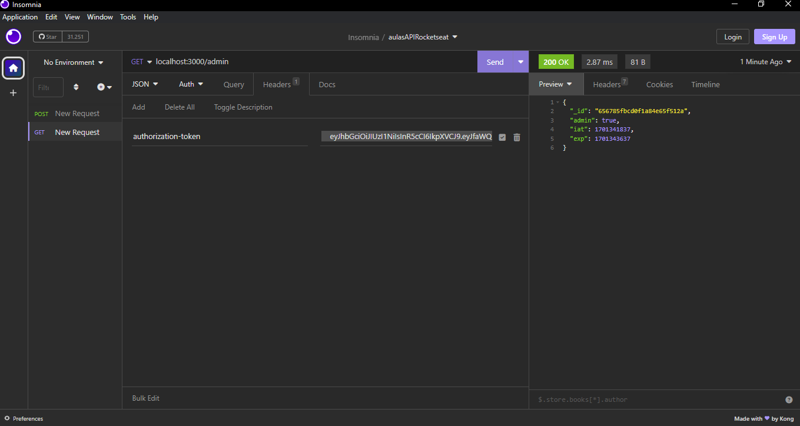

	
  

  

  

 <h1>LoginJWT - Desafio Prático 2</h1>

  <a href="#clipboard-sobre-o-projeto">Sobre o Projeto</a>&nbsp;&nbsp;&nbsp;|&nbsp;&nbsp;&nbsp;
  <a href="#computer-tecnologias-utilizadas">Tecnologias</a>&nbsp;&nbsp;&nbsp;|&nbsp;&nbsp;&nbsp;
  <a href="#closed_book-licença">Licença</a>

## :clipboard: Sobre o Projeto

Desenvolver uma API RESTful para autenticação de usuários, que permita operações de cadastro (sign up),
autenticação (sign in) e recuperação de informações do usuário.

Especificações:
- Persistência de dados;
- Comunicação via JSON;
- Resposta à erros;

## :computer: Tecnologias utilizadas

  
  
  
  

Skills:
- JavaScript;
- Node;
- MongoDB Compass;
- Mongo Cloud;
- Express;
- Dotenv;
- JWT;
- @Hapi/Joi;
- bcryptjs;
- Insomnia (para envio das requisições);

## 🚀 Resultados

Registrando um usuário:

   

Registrando com email já cadastrado:

   

Registrando com dados fora do padrão:
 

Perceba que a validação da senha deve ser feita antes de enviar os dados pra criptografia pois, caso contrário ela ficaria com o número de caracteres que atenderia os requisitos (entre 6 e 200); Para isso foi utilizado o @hapi/Joi.

   

Usuário registrado no banco de dados:

   

Na cloud:

   

Login com senha ou email inválido:

   

Respostas login certo:

   

   

Buscar dados com token inválido:

   

Buscar dados com token válido:

   

## :closed_book: Licença

Esse projeto está sob a licença MIT. Veja o arquivo [LICENSE](https://github.com/JeffersonSilemen/frontendMentor5/blob/main/LICENSE) para mais detalhes.
